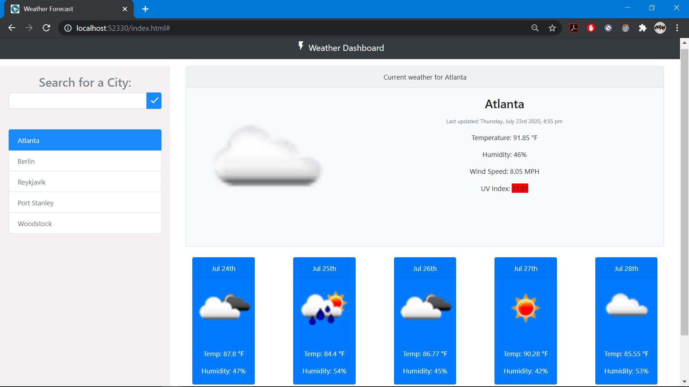
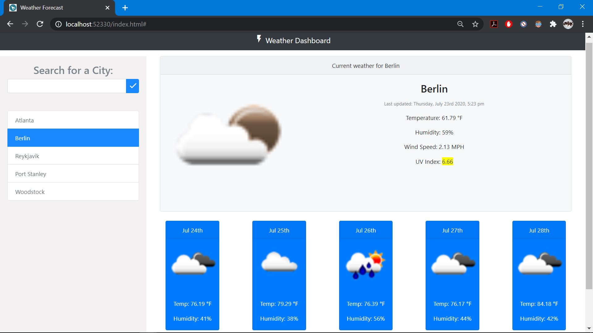
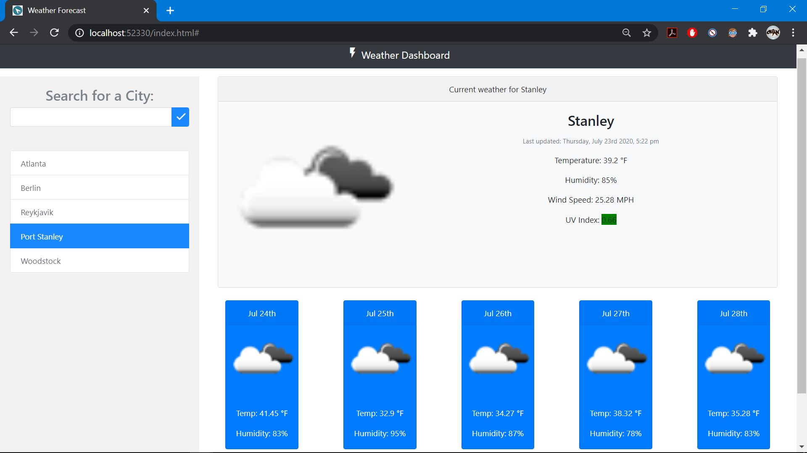
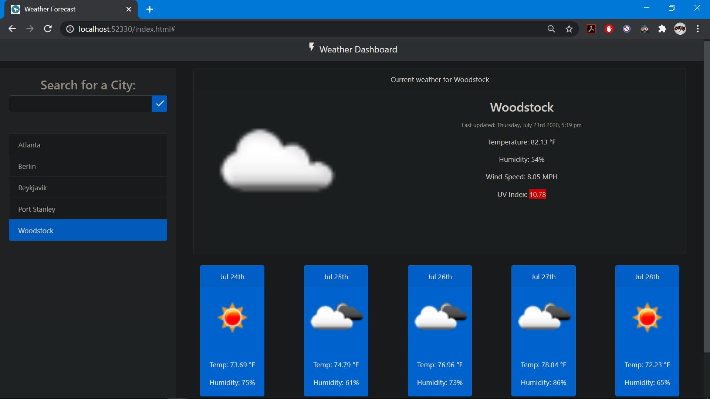

# Weather-Dashboard

This project showcases an interactive web-app that aims to be user friendly and responsive. Upon entering the page for the first time the user will be asked if they would like to share their location, this location will then call upon the open weather api to relay a number of factors about this location including; Temperature, Humidity, Wind Speed, and UV index. If the user prefers to not allow location sharing the page simply loads the current information about the city of Atlanta. On the left side of the UI the user will find a simple search mechanic that allows them to search for any city in the world unlimitedly. The past searches will be saved to local storage and stored conveniently below the search bar interface. At any time the user may click on a previous search to re-display this information. A 5 day forecast for every city that comes with a corresponding image of this upcoming weather pattern is also present at the botton of the UI. Upon leaving and re-entering the page, the user will find their most recently searched for city with an up to date weather refresh that is accurate down the the minute thanks to moment. Dark mode browser functionality is also supported, see image 4. To visit the deployed application please click here: https://chandler8.github.io/Weather-Dashboard/

## User Story

```
AS A traveler
I WANT to see the weather outlook for multiple cities
SO THAT I can plan a trip accordingly

```

## Images








